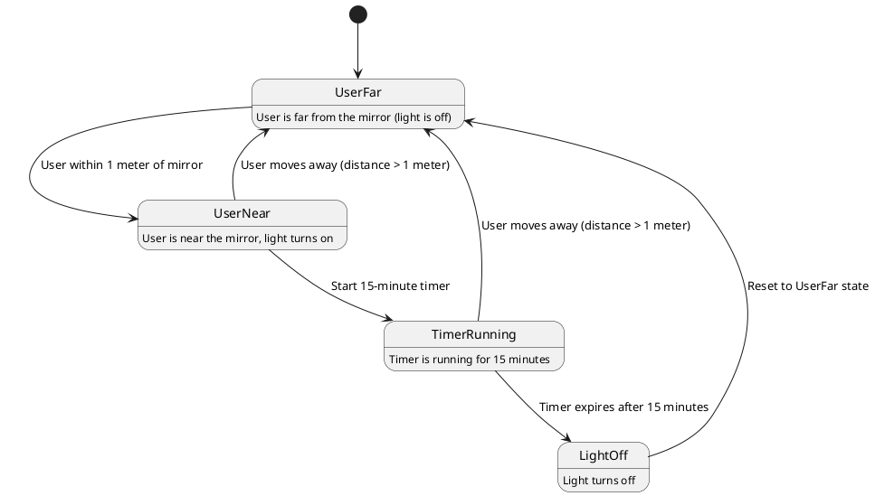

# Chapter 1 : State Diagram for Yaya

```plantuml
@startuml
[*] --> UserFar

UserFar: User is far from the mirror (light is off)
UserFar --> UserNear : User within 1 meter of mirror

UserNear: User is near the mirror, light turns on
UserNear --> TimerRunning : Start 15-minute timer
UserNear --> UserFar : User moves away (distance > 1 meter)

TimerRunning: Timer is running for 15 minutes
TimerRunning --> LightOff : Timer expires after 15 minutes
TimerRunning --> UserFar : User moves away (distance > 1 meter)

LightOff: Light turns off
LightOff --> UserFar : Reset to UserFar state

@enduml

```
