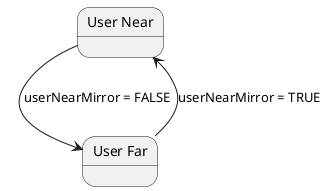

# Chapter 1 : State Diagram for Task 1 : LightControl

```plantuml
@startuml
state "User Near" as UserNear
state "User Far" as UserFar

UserNear --> UserFar : userNearMirror = FALSE
UserFar --> UserNear : userNearMirror = TRUE

@enduml


```