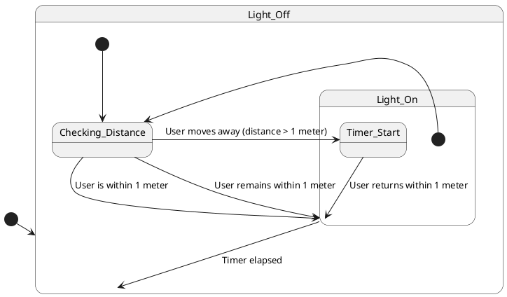

# Chapter 1 : State Diagram for Task 1 : LightControl

Sequence of Events://
1.User Moves Towards Mirror//
2.Timer Check//
3.User Moves Away from Mirror//
4.Turning Off the Light (After 5 seconds)//