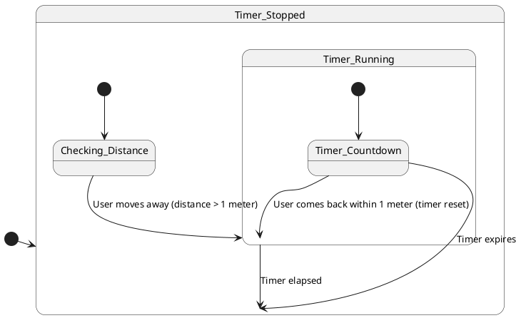

# Chapter 2 : State Diagram for Task 2 : TimerControl

```plantuml
@startuml
[*] --> Timer_Stopped

state Timer_Stopped {
    [*] --> Checking_Distance
    Checking_Distance --> Timer_Running : User moves away (distance > 1 meter)
}

state Timer_Running {
    [*] --> Timer_Countdown
    Timer_Countdown --> Timer_Stopped : Timer expires
    Timer_Countdown --> Timer_Running : User comes back within 1 meter (timer reset)
}

Timer_Running --> Timer_Stopped : Timer elapsed
@enduml
```
