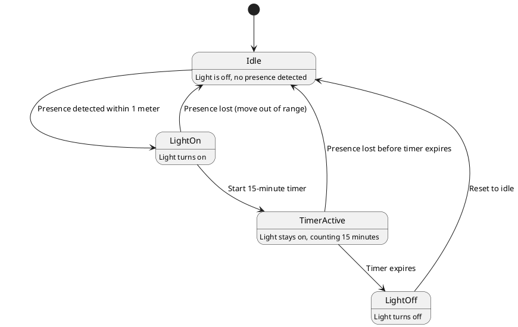

# Chapter 1 : State Diagram for the SmartMirror

[State_list 
1. Idle: The default state where nothing is happening (light is off, no presence detected).
2. Light On: The state where the mirror light is on, triggered by detecting Yaya presence.
3. Timer Active: The state where the 15-minute countdown is in progress after the light has turned on.
4. Light Off: The state where the light is turned off after the 15-minute timer ends or if Yaya move out of range before the timer completes.]