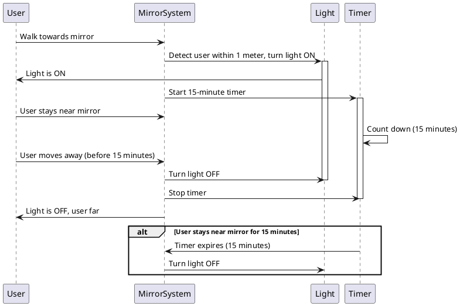

# Chapter 3 : Sequence diagram for Commincation

[Actor list:
1. User: The person approaching and interacting with the mirror.
2. MirrorSystem: The control system that detects the user’s presence and controls the light and timer.
3. Light: The system that turns on and off based on the user’s proximity.
4. Timer: Tracks the 15-minute interval after the light is turned on]