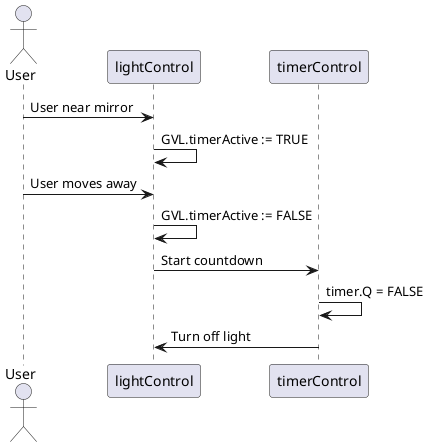

# Chapter 3 : Sequence diagram for Commincation Between Task 1 and 2

```plantuml
@startuml
actor User
participant lightControl
participant timerControl

User -> lightControl : User near mirror
lightControl -> lightControl : GVL.timerActive := TRUE
User -> lightControl : User moves away
lightControl -> lightControl : GVL.timerActive := FALSE
lightControl -> timerControl : Start countdown
timerControl -> timerControl : timer.Q = FALSE
timerControl -> lightControl : Turn off light

@enduml


```