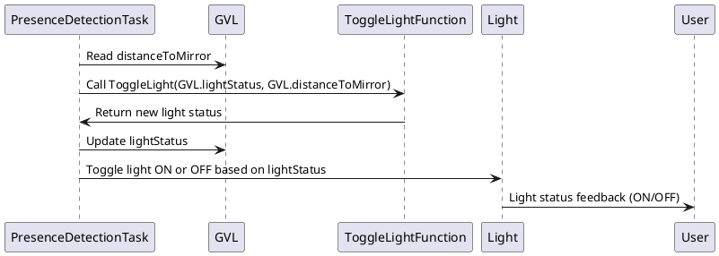

# Chapter 3 : Sequence diagram for Commincation

```plantuml
@startuml
participant PresenceDetectionTask
participant GVL
participant ToggleLightFunction
participant Light

PresenceDetectionTask -> GVL: Read distanceToMirror
PresenceDetectionTask -> ToggleLightFunction: Call ToggleLight(GVL.lightStatus, GVL.distanceToMirror)
ToggleLightFunction -> PresenceDetectionTask: Return new light status

PresenceDetectionTask -> GVL: Update lightStatus
PresenceDetectionTask -> Light: Toggle light ON or OFF based on lightStatus
Light -> User: Light status feedback (ON/OFF)
@enduml

```
