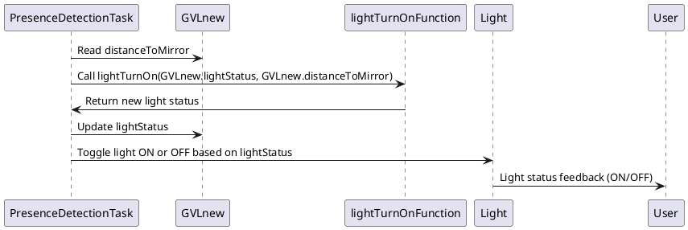

# Chapter 4 : Sequence diagram for Calling the lightTurnOn Function

```plantuml
@startuml
participant PresenceDetectionTask
participant GVLnew
participant lightTurnOnFunction
participant Light

PresenceDetectionTask -> GVLnew: Read distanceToMirror
PresenceDetectionTask -> lightTurnOnFunction: Call lightTurnOn(GVLnew.lightStatus, GVLnew.distanceToMirror)
lightTurnOnFunction -> PresenceDetectionTask: Return new light status

PresenceDetectionTask -> GVLnew: Update lightStatus
PresenceDetectionTask -> Light: Toggle light ON or OFF based on lightStatus
Light -> User: Light status feedback (ON/OFF)
@enduml

```
