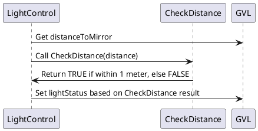

# Chapter 4 : Sequence diagram for Calling the checkDistance Function

```plantuml
@startuml
participant LightControl
participant CheckDistance
participant GVL

LightControl -> GVL: Get distanceToMirror
LightControl -> CheckDistance: Call CheckDistance(distance)
CheckDistance -> LightControl: Return TRUE if within 1 meter, else FALSE

LightControl -> GVL: Set lightStatus based on CheckDistance result
@enduml


```

